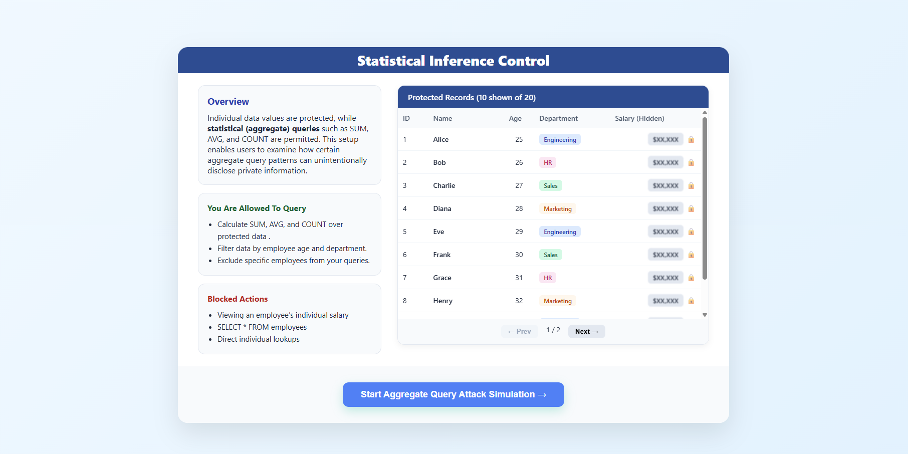
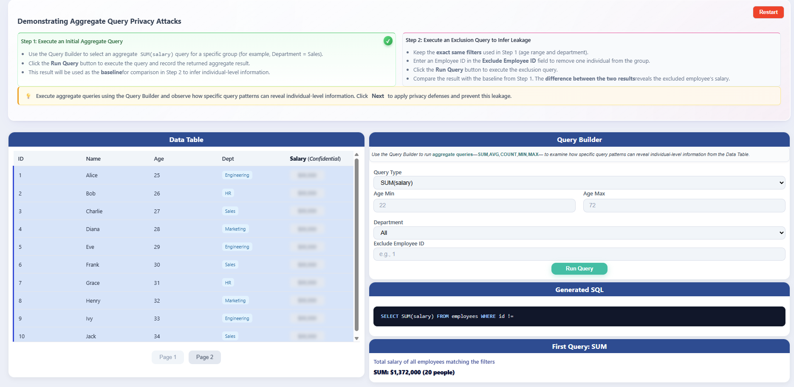
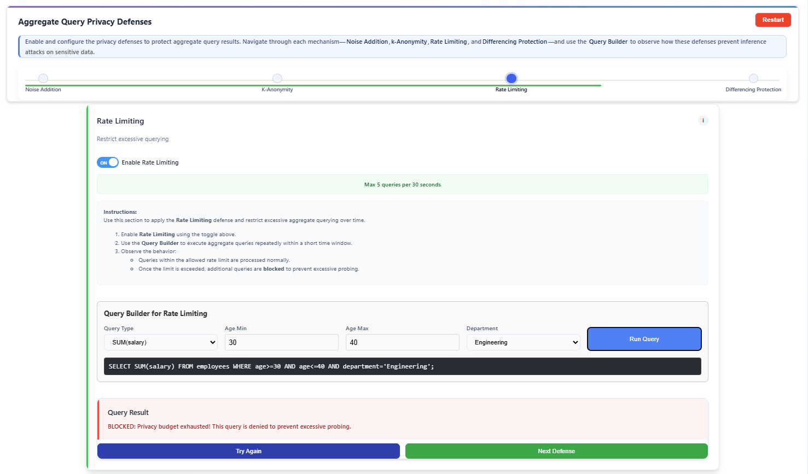

This simulation demonstrates how **aggregate queries** can unintentionally leak **individual-level private information** through a **differencing attack**, highlighting the importance of **statistical inference control mechanisms**.

#### Step 1: Introduction to Statistical Inference Control

- The overview screen explains that individual salary values are protected, while only **aggregate queries** such as `SUM`, `AVG`, and `COUNT` are allowed.
- It highlights that certain aggregate query patterns can still lead to **privacy leakage**.
- Review the **Overview**, **Allowed Queries**, and **Blocked Actions** sections.
- Click **Start Aggregate Query Attack Simulation** to begin.

#### Step 2: Attacker Page – Aggregate Query Privacy Attack

- The **Demonstrating Aggregate Query Privacy Attacks** page introduces the attacker’s perspective, where only **aggregate queries** are permitted.
- Follow the on-screen instructions to execute an initial aggregate query and note the result as the **baseline**.
- Observe the available components:
  - **Data Table** with confidential salary values hidden
  - **Query Builder**
  - **Generated SQL** panel

#### Step 3: Execute Initial Aggregate Query (Baseline Query)

- In the **Query Builder**, select the **Query Type** as `SUM(salary)` using the default filter settings, or apply specific custom filters if required.
- Click **Run Query** to execute the query.
- The system displays the total salary of all employees matching the selected filters, which serves as the **baseline aggregate result**.
- No individual salary is revealed, as the query uses aggregation.

#### Step 4: Execute Exclusion Query and Observe Leakage

- Using the **same filter settings as the baseline query**:
  - Enter an **Employee ID** in the **Exclude Employee ID** field.
- Click **Run Query** again.
- The system executes a **second aggregate query** that excludes the specified employee while keeping all other filters unchanged.
- Compare:
  - **Query 1:** Baseline `SUM(salary)`
  - **Query 2:** `SUM(salary)` excluding one employee
- Observe the **Differencing Attack Detection** panel:
  - The difference between the two results is calculated.
  - This difference reveals the **excluded employee’s exact salary**.

#### Step 5: Apply Noise Addition Defense

- Enable **Noise Addition** using the toggle.
- Adjust the **noise level (ε)** as required.
- Execute an aggregate query using the **Query Builder**.
- Observe that random noise is added to the query result, reducing the accuracy of exact inference.

#### Step 6: Apply k-Anonymity Defense

- Enable **k-Anonymity** using the toggle.
- Set the **minimum group size (k)**.
- Run an aggregate query using the **Query Builder**.
- Queries returning fewer than **k records** are blocked to prevent re-identification.

#### Step 7: Apply Rate Limiting Defense

- Enable **Rate Limiting** using the toggle.
- Set the **maximum number of allowed queries** within the specified time window (the rate limit is **user-editable**, for example, 5 queries per 30 seconds).
- Execute multiple aggregate queries within the specified time interval.
- Observe that once the user-defined query limit is exceeded, further queries are **blocked** or temporarily restricted to prevent excessive probing.

#### Step 8: Apply Differencing Protection Defense

- Enable **Differencing Protection** using the toggle.
- Execute an aggregate query and attempt an **exclude-one** query pattern by excluding a single employee.
- Queries identified as potential differencing attacks are blocked, while safe aggregate queries return protected aggregate results.

