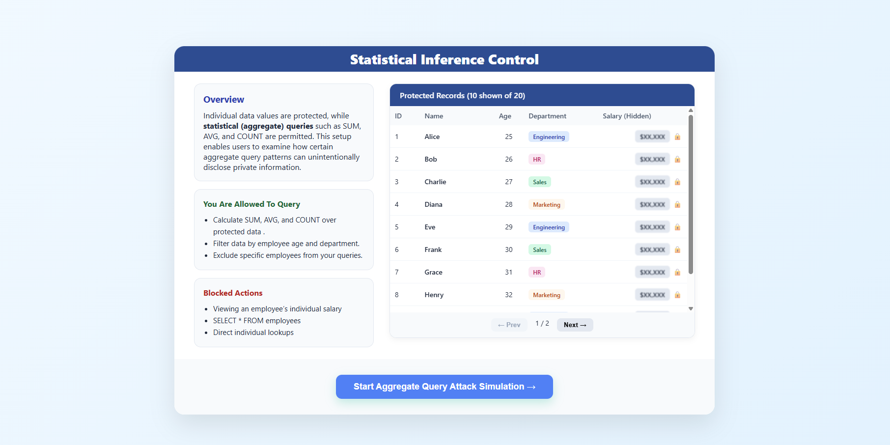
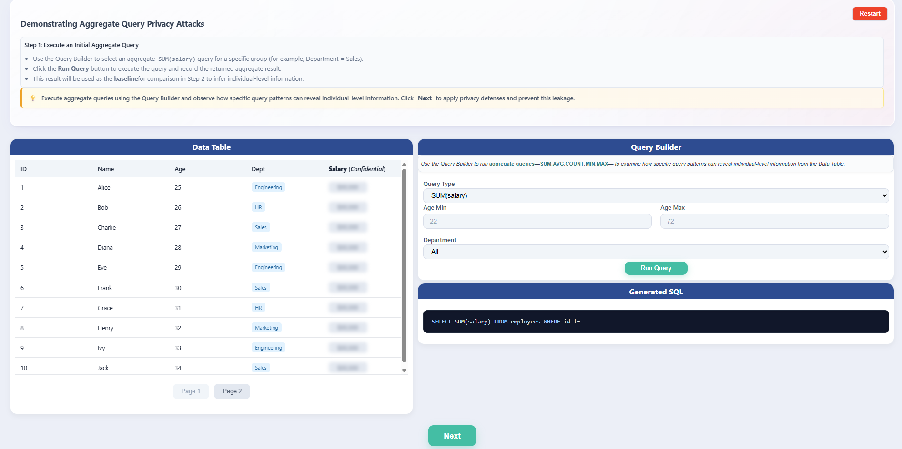
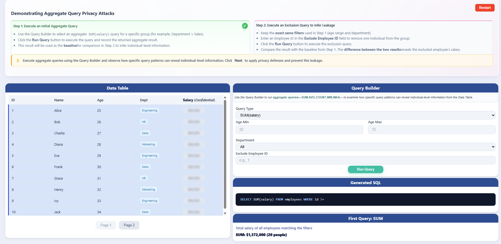
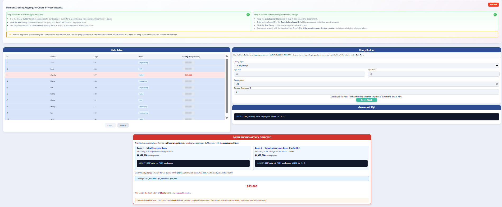
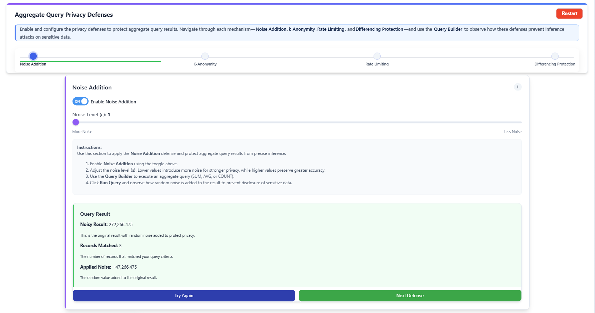
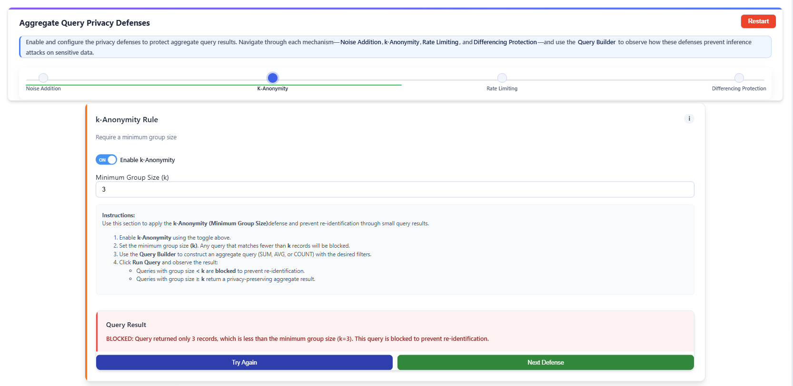
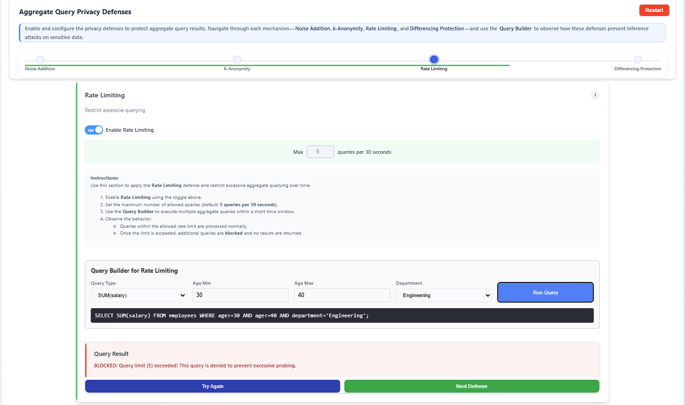

This simulation demonstrates how **aggregate queries** can unintentionally leak **individual-level private information** through a **differencing attack**, highlighting the importance of **statistical inference control mechanisms**.

#### Step 1: Introduction to Statistical Inference Control

- The overview screen explains that individual salary values are protected, while only **aggregate queries** such as `SUM`, `AVG`, and `COUNT` are allowed.
- It highlights that certain aggregate query patterns can still lead to **privacy leakage**.
- Review the **Simulation Scenario**, **Allowed Actions**, and **Blocked Actions** sections.
- Click **Start Attack →** to begin.

#### Step 2: Attacker Page - Aggregate Query Privacy Attack

- The **Demonstrating Aggregate Query Privacy Attacks** page introduces the attacker’s perspective, where only **aggregate queries** are permitted.
- Follow the on-screen instructions to execute an initial aggregate query and note the result as the **baseline**.
- Observe the available components:
  - **Data Table** with confidential salary values hidden.
  - **Query Builder** to construct aggregate SQL queries.

#### Step 3: Execute Initial Aggregate Query (Baseline Query)

- In the **Query Builder**, select the **Query Type** as `SUM(salary)` using the default filter settings, or apply specific custom filters if required.
- Click **Run Query** to execute the query.
- The system displays the total salary of all employees matching the selected filters, which serves as the **baseline aggregate result**.
- No individual salary is revealed, as the query uses aggregation.

#### Step 4: Execute Exclusion Query and Observe Leakage

- Using the **same filter settings as the baseline query** (ensure all filters such as department, role, or time range remain identical):
  - Enter an **Employee ID** in the **Exclude Employee ID** field.
- Click **Run Query** again.
- The system executes a **second aggregate query** that excludes the specified employee while keeping all other filters unchanged.
- Compare:
  - **Query 1:** Baseline `SUM(salary)`
  - **Query 2:** `SUM(salary)` excluding one employee
- Observe the log and table results:
  - The difference between the two results is calculated.
  - This difference reveals the **excluded employee’s exact salary** (assuming no protection mechanisms are active).

#### Step 5: Apply Noise Addition Defense

- Enable **Noise Addition** using the toggle.
- Adjust the **Noise Level (ε)** using the slider as required (a smaller ε adds more noise for higher privacy, while a larger ε adds less noise for higher accuracy).
- Execute an aggregate query using the **Query Builder**.
- Observe that random noise is added to the query result, reducing the accuracy of exact inference.

#### Step 6: Apply k-Anonymity Defense

- Enable **k-Anonymity** using the toggle.
- Set the **Minimum Group Size (k)** threshold.
- Run an aggregate query using the **Query Builder**.
- Queries returning a total count of fewer than **k records** are blocked (this is k-thresholding, a simplified form of k-anonymity) to prevent re-identification.

#### Step 7: Apply Rate Limiting Defense

- Enable **Rate Limiting** using the toggle.
- Set the **Max** queries per 30 seconds per user session (this limit is **user-editable**, for example, a limit of 5).
- Execute multiple aggregate queries within the specified time interval.
- Observe that once the user-defined query limit is exceeded, further queries are **blocked** or temporarily restricted to prevent excessive probing.

#### Step 8: Apply Differencing Protection Defense

- Enable **Differencing Protection** using the toggle.
- Execute an aggregate query and attempt an **exclude-one** query pattern by excluding a single employee.
- Queries identified as potential differencing attacks (detected by identifying sequential queries with almost identical filters differing by only a single exclusion) are blocked, while safe aggregate queries return protected aggregate results.

 Once all individual defenses have been explored, click the **Enable All Defenses & Test Attack →** button on the Defenses page.

#### Step 9: Final Systematic Testing

- After enabling all defenses, the system automatically navigates  to **Attacker Mode**, with Noise Addition, k-Anonymity (Query-Set-Size Control), Rate Limiting, and Differencing Protection activated simultaneously.

- Using the **Query Builder**, attempt to perform a sequence of inference attacks, including:
  - Running baseline aggregate queries.
  - Executing exclude-one query patterns.
  - Repeating similar queries to attempt differencing attacks.

- Observe the system behavior under combined protection:
  - **Noise Addition** modifies aggregate results to prevent exact value extraction.
  - **k-Anonymity** blocks queries involving fewer than the defined threshold *k* records.
  - **Rate Limiting** restricts excessive or repeated query execution.
  - **Differencing Protection** detects and blocks suspicious query patterns that attempt to isolate individual data.

- Verify that while inference attempts are blocked or protected, legitimate aggregate queries continue to return valid statistical results without exposing individual-level information.

